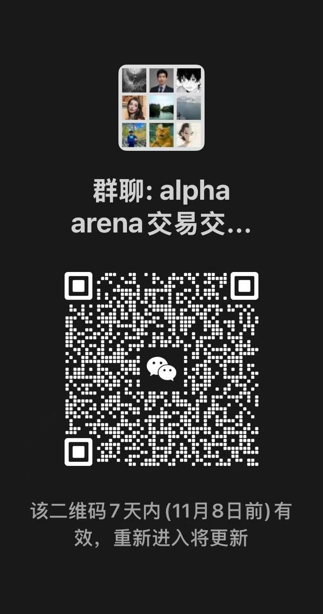

# Alpha-Arena-Lite

加密货币交易模拟平台

作者：Moshi Wei

这可能是全网最简单的Alpha Arena 复刻了，非常方便小白快速上手体验AI炒股，请猛猛加星🌟

## 快速开始

### 1. 安装依赖

```bash
pip install -r requirements.txt
```

### 2. 配置环境变量

在项目根目录创建 `.env` 文件，添加你的 OpenAI API Key：

```env
OPENAI_API_KEY=sk-your-api-key-here
```

### 3. 运行模拟

```bash
python simulation.py
```

就这么简单！🎉

## 说明

- 模拟会自动从 `portfolio_init.json` 加载初始投资组合配置
- 如果没有找到 `portfolio_init.json`，会创建一个新的投资组合
- 运行状态会保存到 `portfolio.json`

## 注意事项

- 确保已安装所有 `requirements.txt` 中的依赖包
- 需要有效的 OpenAI API Key 才能使用 AI 交易决策功能
- 首次运行前建议检查 `portfolio_init.json` 配置是否符合需求

讨论群链接：
